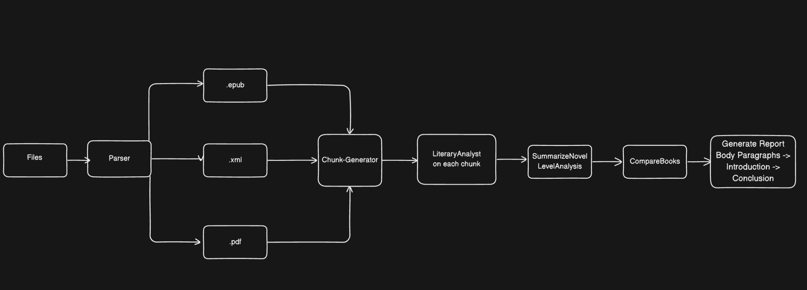

# Overview 

Code to generate a typical five-paragraph book report that is a comparative analysis on multiple different texts with a specific theme in mind using LLM calls.

# How to Run

Run the code `reproduce.ipynb` to generate the book report. The code in `all_scripts.ipynb` includes all the functions and Testing workflows listed below. The file `llm_calls.py` contains all the function calls involving `openai` models whereas `parsing.py` includes all the functions regarding parsing input files, generating chunks, and writing output file. 

# Workflow

# Testing

Tested Multiple Different Approaches
Used gpt-4o only unless otherwise stated 

Test 0 Workflow: 

Generate an Analysis for Each Novel 
Generate Comparitive Analysis based on the Analysis of Each Novel
Generate 5-paragraph Report with One Single Call

Test 1 Workflow:  
Generate analysis for each chunk independently (granularity of at least one chapter per call)
Generate Novel-level analysis to combine the results of each chunk into one analysis
Generate Comparative Analysis of the 3 Novel-level analyses 
Generate 5-paragraph Report with One Single Call

Test 2 Workflow:

PT1 Changes: Generate each chunk independently (split so chunks are equal in size rather than by chapter) 
PT2 Changes: Generate each chunk-analysis so that they are given the context of previous analyses. - (incremental merging)

Test 3:

Found that Test 1 was the best
Changes: Novel-level analysis done by passing in two chunks at a time and combining until there's one left (mergesort approach) - hierarchal merging

Test 4 Workflow:

Found that Test 1 Workflow was the best
Generate 5-Paragraph Report with multiple calls (Body Paragraphs -> Introduction -> Conclusion)

Test 5 Workflow:

Found that Test 4 Workflow was the best 
gpt 3.5 for chunk level, gpt-4o for rest 

Final code in `reproduce.ipynb` is Test 4 Workflow.
